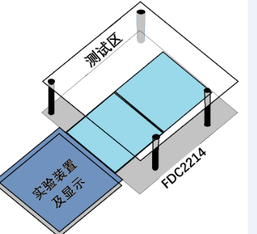
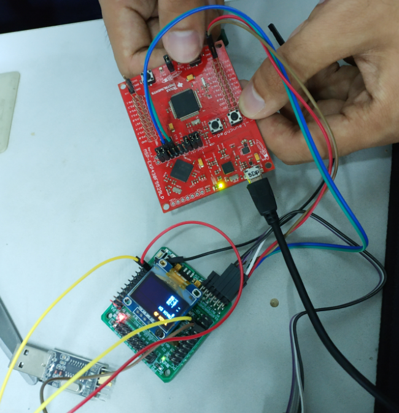
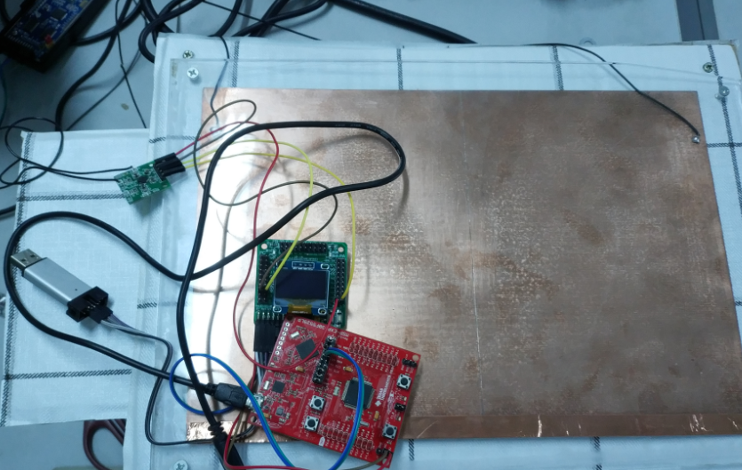
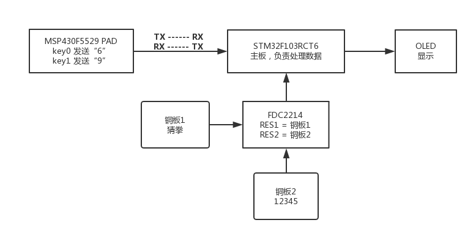

***
&emsp;&emsp;没想到能拿到省一，本文做个简单记录
## D题：手势识别装置

https://www.nuedc-training.com.cn/index/news/details/new_id/56

### 任务
基于TI公司传感芯片FDC2214设计制作一个手势识别装置，实现对猜拳游戏和划拳游戏的判决。该装置也可以直接使用FDC2214 EVM板，要求所使用的FDC2214芯片或者EVM板不得超过2块。

装置具有训练和判决两种工作模式。在判决模式下实验装置能对指定人员进行猜拳游戏和划拳游戏的判决。这里猜拳游戏的判决是指对手势比划“石头”、“剪刀”和“布”的判定，划拳游戏的判定是指手势比划“1”、“2”、“3”、“4”和“5”的判定。在训练模式下能对任意人员进行猜拳游戏和划拳游戏的手势训练，经过有限次训练后，能进行正确的猜拳游戏和划拳游戏的手势判决。
<!--more-->
### 要求
（1）装置工作在判决模式下，能对参赛者指定人员进行猜拳判决，给出手势“石头”、“剪刀”和“布”的准确判决，要求每一次判决的时间不大于1秒。                 （18分）

（2）装置工作在判决模式下，能对参赛者指定人员进行划拳判决，给出手势“1”、“2”、“3”、“4”和“5”的准确判决，要求每一次判决的时间不大于1秒。            （28分）

（3）装置工作在训练模式下，对任意测试者进行猜拳的手势训练，每种动作训练次数不大于3次，总的训练时间不大于1分钟；然后切换工作模式到判决模式，对被训练的人员进行猜拳判决，要求每一次判决的时间不大于1秒。        （21分）

（4）装置工作在训练模式下，对任意测试者进行划拳的手势训练，每种动作训练次数不大于3次，总的训练时间不大于2分钟；然后切换工作模式到判决模式，对被训练的人员进行划拳判决，要求每一次判决的时间不大于1秒。        （29分）

（5）其他。                                             （ 4分）
（6）设计报告。                                         （20分）
***
## 思路
### 1 - 设备搭建
&emsp;&emsp;FDC2214是一种电容传感器，将传感器接一块极板。手在接近极板时就会影响极板的电容值，这个电容值会由FDC2214给出。根据测试，手接触极板的面积与返回的电容值相关，根据这个原理就能进行简单的手势识别。

设备搭建只需根据题目所给的测试样例，当然极板是越灵敏越好，一般铜板就能凑合用。
 

### 2 - 硬件设计及开发环境
&emsp;&emsp;由于各种条件限制，而且本人也是第一次接触单片机开发（之前有过一段arduino的开发经验），所以走了许多弯路。

主要的困难有三个：

&emsp;&emsp; 一：FDC2214没有买evm开发板，很不好调试，为了调试队友买了[stm32f103rct6](https://www.st.com/en/microcontrollers/stm32f103rc.html)，淘宝店自带了OLED板和标程。

&emsp;&emsp; 二：在队友全麻瓜状态下，就只能靠自己摸了。stm32搞懂后，有个问题就是无法调试，折腾半天发现是线坏了。

<font color="#dd0000">重要经验：当你毫无头绪的时候，往往就是接触不良，或者硬件坏了。</font>

&emsp;&emsp; 三：stm32能调试以后，又一个坑是队友买的是最小系统板，没有带按钮。自己焊按钮还要去抖等等各种复杂操作，太麻烦，也来不及学。好在我之前做arduino知道，办法总比困难多，解决方案是用Ti的msp430的evm板，自带了两个按钮，然后用[msp430f5529 LaunchPad](http://www.ti.com/tool/msp-exp430f5529lp)的UART串口与stm32板通信。

&emsp;&emsp; 一个好的工程师一定不能执着于技术，什么方法简便易行，稳定可靠就用什么方法，切忌花里胡哨把自己带入坑里。ti的板子开发一般用CCS，语法奇奇怪怪，引脚的设定也很奇怪。为了快速上手我找到了ti系列的arduino，也就是[energia](http://energia.nu/)，Ti官方也有支持，很不错的IDE。

在energia里选好板子，就可以直接开发了，跟arduino一类的语法，引脚使用直接digitalWrite什么的，很方便。

<p></p>

&emsp;&emsp;至于stm32就老老实实用MDK 5，代码就是纯C，不难懂。有几个坑就是连接器一定要搞明白，有ST-Link的，也有Jtag的古老方式的。具体的搜百度。

最后的硬件方案如图（手不是我）：






### 3 - 程序设计

程序流程如图：


&emsp;&emsp;总的思路就是，用msp430的按键发送命令，6用于模式切换，9发一次开始训练，再发一次结束训练并自动返回均值。判决就根据这均值取范围，很简单的算法，不过很有效。注意的一点就是，UART的跳线，TX要接对应的RX，波特率要匹配。

#### 主体结构
```c
int main(void){
	u8 t = 0;			//状态位，0为判决模式，1，2，3，4，5，剪刀石头布 1-8
	u8 len;
	u8 flag = 0;			//判断开始键是否按下
	u8 count = 0;			//样本个数
	float temp = 0;			//save mean
  	Sys_Init();
	while(1)
	{
		if(USART_RX_STA&0x8000)	//UART收到信息
		{
			len = USART_RX_STA&0x3f;
			if(USART_RX_BUF[0] == 54){		//UART
				if(t < 8)		//收到6，进入状态循环，0-8
					t++;
				else
					t = 0;
			}
			if(USART_RX_BUF[0] == 57){		//收到9开始训练，再收到一次则取均值
				if(flag){					// mean = sum / 样本数
					flag = 0;
					sp[t - 1] = temp / count;
					temp = 0;
					count = 0;
				}
				else 
					flag = 1;
			}
			USART_RX_STA=0;
		}
		showHead(t);			//信息显示
		OLED_P6x8Str(0, 0, AsciiBuff, 0);	//OLED字符串显示 ， （x， y， string， flag）

		if(flag){							
			if(t > 5)
				temp += res0 - temp0;		//大于5时才是剪刀石头布训练
			else
				temp += res1 - temp1;
			count++;
			showHead(66);
		}
		else showHead(99);
		OLED_P6x8Str(0, 2, AsciiBuff, 0);
		
		u8ToAscii(0, JudgeType(res0 - temp0));
		OLED_P6x8Str(0, 1, AsciiBuff, 0);

		u8ToAscii(JudgeNum(res1 - temp1), 4);
		OLED_P6x8Str(0, 3, AsciiBuff, 0);
		
		//OLED浮点数显示 ， （x， y， float， flag）	
		Oled_Printf_Float(0, 7, sp[t - 1], 0);	//当前均值信息
		//Oled_Printf_Float(0, 5, res0 - temp0, 0);
		Oled_Printf_Float(0, 5, res0 - temp0, 0);		//剪刀石头布pf  temp为电容板的初始电容值，在init里写
		Oled_Printf_Float(0, 6, res1 - temp1, 0);		//12345电容值
		while(USART_GetFlagStatus(USART1, USART_FLAG_TC) == RESET);	//UART通信结束
		delay_ms(100);
	}
}
```

#### ASCII显示

```c
void u8ToAscii(u8 num, int type)			//显示程序，num为数字，type决定猜拳划拳
{						//OLED格式 8*8
	u8 i = 0;
	AsciiBuff[7] = 32;					//第八位为空格
	switch(type){
    	case 1:
    		AsciiBuff[0] = 74;
			AsciiBuff[1] = 105;
			AsciiBuff[2] = 97;  
			AsciiBuff[3] = 110;  
			AsciiBuff[4] = 100;
			AsciiBuff[5] = 97;
			AsciiBuff[6] = 111;			//ASCII码 Jiandao
			break;
		case 2:
    ......
			break;
	}

}

void showHead(u8 type){
  	AsciiBuff[0] = 84;
	AsciiBuff[1] = 82;
	AsciiBuff[2] = 65;  
	AsciiBuff[3] = 73;  
	AsciiBuff[4] = 78;
	AsciiBuff[5] = 32;	
	AsciiBuff[7] = 32;				//ASCII码 TRAIN
	switch(type){
    	case 0:
      AsciiBuff[0] = 74;
			AsciiBuff[1] = 85;
			AsciiBuff[2] = 68;  
			AsciiBuff[3] = 71;  
			AsciiBuff[4] = 69;
			AsciiBuff[5] = 32;
			AsciiBuff[6] = 32;		//ASCII码 JUDGE
			break;
    	case 1:
			AsciiBuff[6] = 49;		//1 - 5
    		break;
    	case 2:
    ......
			break;
	}
}
```

#### 训练

```c
int JudgeType(float pf){						//sp为训练的均值
	if(pf < sp[5] + 0.6 && pf > sp[5] - 0.6)	//jiandao 
		return 1;
	if(pf < sp[6] + 0.4 && pf > sp[6] - 0.5) 	//shitou
		return 2;
	if(pf > sp[7] - 0.2) 						//bu
		return 3;
	return 5; 									// erorr
}

u8 JudgeNum(float pf){		
	if(pf < sp[0] + 0.6 && pf > sp[0] - 0.6) 
		return 1;
	if(pf < sp[1] + 0.5 && pf > sp[1] - 0.5) 
		return 2;
	if(pf < sp[2] + 0.45 && pf > sp[2] - 0.45) 
		return 3;
	if(pf < sp[3] + 0.4 && pf > sp[3] - 0.4) 
		return 4;
	if(pf > sp[4] - 0.2)
		return 5;
	return 0;
}
```

***
## 总结
&emsp;&emsp; 硬件太难做了，很多坑，很多时候不只是理论知识，更需要经验堆积。还是投入软件赚钱比较轻松。
### Reference
&emsp;&emsp;http://energia.nu/pinmaps/msp-exp430f5529/

&emsp;&emsp;http://www.ti.com.cn/product/cn/FDC2214/technicaldocuments

&emsp;&emsp;https://www.cnblogs.com/zjvskn/p/5757962.html

&emsp;&emsp;https://github.com/treasersimplifies/GestureRecognition
