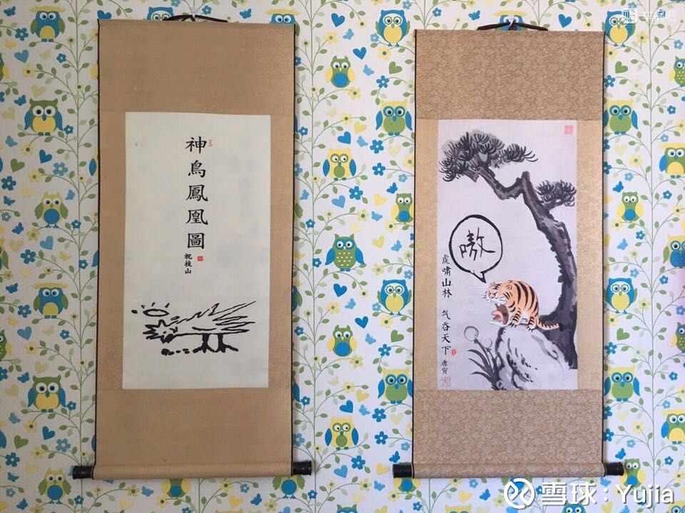

# New Or Die

&emsp;&emsp;这是一篇个人随笔感悟。

&emsp;&emsp;如果我们穿越回1938年，我们不会以为自己在经历二战，会以为只是中日的又一起局部战争。如果我们穿越回1930年，不会以为自己经历的是美国股市的大底部，会以为只是又一轮熊市的轮回。如果我们回到1990年，我们又会以为只是一轮熊市的轮回，但其实是“丢失的20年”的开始……

&emsp;&emsp;历史不会简单的重复，如今中国的90后生在了一个非常尴尬的时代，错过改革开放的机遇，前有高校扩招带来的文凭贬值，后有老龄化的大潮。阶级固化在即，个人的作为渺茫。但是只会抱怨的人是弱者，危机危机，危中有机，有多少人被打到就有多少人有机会翻身。**做那个翻身的。**

*“风物长宜放眼量”*

*亦是今日人民日报标题*

---

## 股指

&emsp;&emsp;熊市最残酷时期，未来难以预测，要么更跌，那就是经济彻底进入日本90年代，投什么都没用。要么就是获得新生，那现在就是买入的最佳时刻。

## 科技

&emsp;&emsp;中国没有真正的科技股，百度阿里腾讯一个都不是，因为没有一个是靠科技赚钱的。中国需要的是一个真正科技驱动的公司，然而很遗憾数千年来的儒家文化导致我们的文化缺乏自由与独立的精神。随着受西方教育的荼毒，这个现象应该会慢慢改变。
## 个人学习

>当一个人口众多的国家，个人行动全凭儒家简单粗浅而又无法固定的原则所限制，而法律又缺乏创造性，则其社会发展的程度，必然受到限制。即便是宗旨善良，也不能补助技术之不及。1587年，是为万历十五年，丁亥次岁，表面上似乎是四海升平，无事可记，实际上我们的大明帝国却已经走到了它发展的尽头。在这个时候，皇帝的励精图治或者宴安耽乐，首辅的独裁或者调和，高级将领的富于创造或者习于苟安，文官的廉洁奉公或者贪污舞弊，思想家的极端进步或者绝对保守，最后的结果，都是无分善恶，统统不能在事业上取得有意义的发展，有的身败，有的名裂，还有的人则身败而兼名裂。

——黄仁宇，《万历十五年》

&emsp;&emsp;人生的本质就是：**失败总是不可避免的。** 从态度上讲，如果你一直纠结于失败，你会活的很累，只有彻底能接受失败十有八九这一事实，你才能全力以赴。从方法上讲，本人最近的经验就是习惯能解决拖延症和懒的问题，更戒烟戒酒是一个道理，开始的第一个星期很难受，一个月养成习惯，一年后你的本质就改变了。如果意志力薄弱，那就养成习惯。至于第一个星期怎么度过，没有秘诀，就是坚持，然后不断地正反馈自己。
