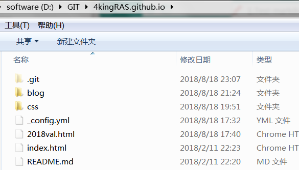

# 1. hexo 搭建github pages
简单记录一下步骤

<!--more-->

## 1.1. github pages申请
就是申请xxxx.github.io的仓库，不过要注意jekyll需要分支为gh-pages，hexo只需要master、

## 1.2. hexo 搭建
在需要建博客的目录（无须进入io仓库）进入Git bash，然后

```
$ hexo init
$ hexo g
```

g生成后，在public里的就是博客的网页。
在_config,yml里这么安排，这样主页还能自定义。

```
url: http://4kingras.github.io/blog
root: /blog/
```

## 1.3. github 部署
配置好github的 ssh key， 然后先生成博客页面，复制到io仓库下，然后手动commit。

最终的目录结构



## 1.4. hexo写博客页面
有几个坑，一是插入图片，
1 要先把配置文件`_config.yml `里的`post_asset_folder:`这个选项设置为`true`
2 在你的hexo目录下执行这样一句话`npm install hexo-asset-image --save`

如果想增加read more效果 可以在指定位置加入`<!--more-->`


